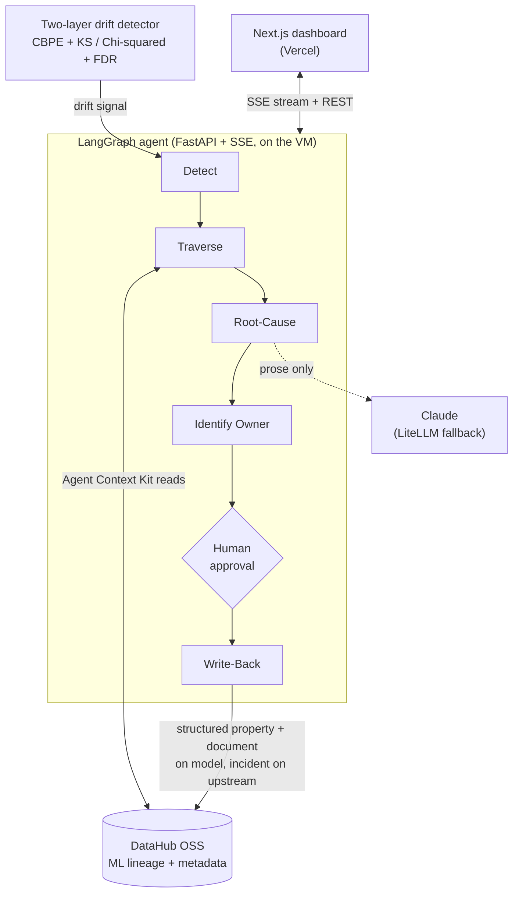

# Silent-Drift Sentinel

An on-call AI agent for the ML engineer who owns a silently degrading production model. When a model quietly loses accuracy, the Sentinel detects it, walks DataHub's ML lineage to the exact upstream column that changed, identifies the owner, and writes the cause back onto the model so the next engineer or agent inherits the answer instead of rediscovering it.

Built for the Build with DataHub: The Agent Hackathon. Track: Agents That Do Real Work.

## Live demo

| Surface | URL |
|---|---|
| Dashboard | https://silent-drift-sentinel-web.vercel.app/dashboard |
| Agent API | https://agent.16-59-185-192.nip.io |
| DataHub catalog | https://datahub.16-59-185-192.nip.io (login `datahub` / `datahub`) |

Open the dashboard and press **Run agent (live)** or **Demo**. You will watch the agent detect the drift, walk the lineage graph to the upstream table, reason about the cause, and write the `drift_causation` object onto the model page, with a real incident landing on the upstream table in the DataHub catalog.

## The problem

Roughly 80% of production ML failures trace to data and pipeline issues, not model weights (directional, widely cited). Peer-reviewed work found 91% of tested model and dataset pairs degraded over time (Vela et al., Scientific Reports 2022). The structural pain is coordination without authority: the person who detects a degradation is almost never the person with the information and authority to fix it. The data engineer fixes a normalization bug; the model was trained on the old values; accuracy drifts down for two weeks and nobody connects it to the pipeline change.

## What is genuinely novel

Four parts, framed honestly:

- Detect a silently degrading model from a drift signal: commodity (Evidently, NannyML, Arize, Fiddler, Databricks). Conceded.
- Root-cause the specific upstream change by traversing lineage: partially novel for models. Solved for data incidents (Monte Carlo, Bigeye, Anomalo); DataHub docs frame the model to upstream trace as a human task.
- Identify the model owner from catalog metadata: commodity. Conceded.
- Write a durable `drift_causation` object back onto the model entity in an open-source catalog: the defensible contribution. The write primitive exists (structured properties, documents), but no tool populates it with automated drift root-cause output.

The novelty sits at the seam of parts 2 and 4. We state it as "no public prior art found," not proof of non-existence. Root cause is lineage-guided correlation, not proven causation, and the app says so.

## Architecture



The agent runs on one always-on cloud VM behind Caddy TLS; the dashboard is on Vercel. Claude writes only the prose narrative and is kept out of the write path, which is deterministic and idempotent (write-ahead log).

- **ML core (`ml/`)**: a calibrated LightGBM purchase-intent model on the UCI Online Shoppers dataset (CC BY 4.0). Honest temporal split, isotonic calibration verified with ECE and a reliability diagram.
- **Drift detector (`ml/sentinel_ml/drift.py`)**: two layers. Primary is NannyML CBPE label-free performance estimation. Diagnostic is per-feature drift (KS, Chi-squared) with Benjamini-Hochberg FDR correction, a PCA reconstruction check, and data-quality fingerprinting. It distinguishes a harmful null/default regression (which degrades the model) from a benign unit rescale (which does not), and only alarms on the former.
- **Lineage (`datahub/emit/`)**: SDK-emitted chain of web_sessions table, features, model, deployment, and owners, into DataHub.
- **Agent (`services/agent/`)**: a five-node LangGraph state machine (Detect, Traverse, Root-Cause, Identify Owner, Write-Back). It reads DataHub through the Agent Context Kit tools, has Claude write the root-cause narrative, and executes the write-back deterministically behind a write-ahead log. Incidents cannot be raised on ML models in DataHub, so the write-back is split: a structured property, tag, and document on the model, and an incident on the upstream dataset.
- **Dashboard (`apps/web/`)**: Next.js 16, React Flow lineage graph with ELK layout, Apache ECharts drift charts, and a streamed agent-reasoning panel that ends in the model-page write-back reveal.

## Run it locally

Prerequisites: Docker (8GB+), Python 3.11, Node 22, uv, pnpm.

1. DataHub + datapack:
   ```
   pip install acryl-datahub && datahub docker quickstart && datahub datapack load showcase-ecommerce
   ```
2. ML pipeline (train the model, produce the drift signal):
   ```
   uv venv ml/.venv --python 3.11 && uv pip install -e ml
   python ml/scripts/fetch_data.py && python -m sentinel_ml.train && python ml/scripts/run_drift.py
   ```
3. Emit the lineage into DataHub, then run the agent:
   ```
   uv venv services/agent/.venv --python 3.11 && uv pip install -e services/agent
   DATAHUB_GMS_URL=http://localhost:8080 python datahub/emit/emit_lineage.py
   DATAHUB_GMS_URL=http://localhost:8080 python services/agent/scripts/run_once.py
   ```
4. Dashboard:
   ```
   pnpm -C apps/web install && NEXT_PUBLIC_AGENT_URL=http://localhost:8130 pnpm -C apps/web dev
   ```

Sample outputs live in `examples/`.

## Honest notes

- Root cause is lineage-guided correlation plus data-quality evidence, not proven causation.
- The primary signal is label-free performance estimation (CBPE), which is valid under covariate shift and calibrated probabilities but not under concept drift; the app reports the estimate as directional.
- The demo dataset is real (UCI Online Shoppers) and the injected failure is a realistic pipeline bug (an upstream job emitting a default value), not synthetic noise. A deterministic demo mode replays a recorded run so the stream is identical every time; the same code path runs live.

## License

Apache-2.0. See [LICENSE](./LICENSE).
