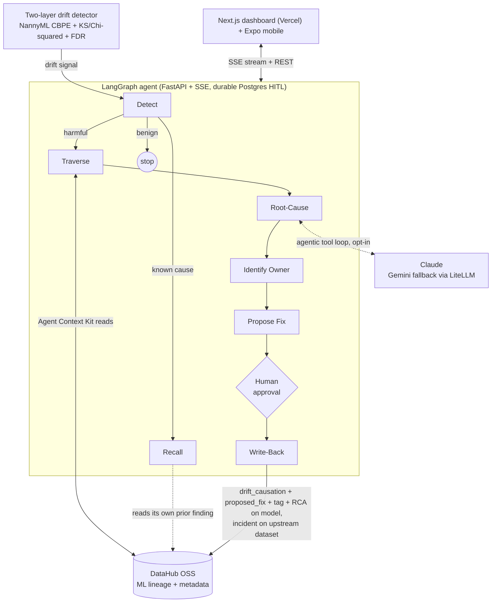

# SILENT-DRIFT SENTINEL

**An on-call AI agent that catches a silently degrading production ML model, walks DataHub's ML lineage to the exact upstream column that broke it, identifies the owner, and writes the cause back onto the model, so the next engineer or agent inherits the answer instead of rediscovering it.**

[](https://github.com/StephenSook/silent-drift-sentinel/actions/workflows/ci.yml)
[](./LICENSE)
[](https://silent-drift-sentinel-web.vercel.app/dashboard)


Built for **Build with DataHub: The Agent Hackathon**. It is built to hit four tracks at once: **Agents That Do Real Work** (primary), **Production ML Agents**, **Metadata-Aware Code Generation**, and **Open / Wildcard**.

DataHub is not a backdrop here. It is the graph the agent reasons over, the authority it reads the owner from, and the durable surface it writes the finding back onto. The whole point is to turn the catalog from a place you look things up into a place an agent leaves knowledge for the next agent.

## Live demo

| Surface | URL |
|---|---|
| Dashboard | https://silent-drift-sentinel-web.vercel.app/dashboard |
| Agent API | https://agent.16-59-185-192.nip.io |
| DataHub catalog | https://datahub.16-59-185-192.nip.io (login `datahub` / `datahub`) |
| Android app (APK) | https://github.com/StephenSook/silent-drift-sentinel/releases/download/v1.0.0/silent-drift-sentinel.apk |

Phone install: scan the QR below (or grab the APK from the [v1.0.0 release](https://github.com/StephenSook/silent-drift-sentinel/releases/tag/v1.0.0)), open it on any Android device, and accept the unknown-source prompt. The app is the on-call experience wired to the same live agent.


Open the dashboard, press **Run agent (live)**, approve the write-back, then click **Run again (recall)**. You will watch the agent detect the drop, walk the lineage to the upstream table, reason about the cause, write the `drift_causation` object onto the real model page (with a matching incident on the upstream dataset), and on the second run recognize its own recorded finding and stop. Flip the **Agentic** toggle to watch Claude drive the catalog reads itself in a live tool-calling loop. A **Demo** button replays a recorded run identically, over the same code path, as a safety take.

## The problem

Roughly 80% of production ML failures trace to data and pipeline issues, not model weights (directional, widely cited). Peer-reviewed work found 91% of tested model and dataset pairs degraded over time (Vela et al., Scientific Reports 2022). The structural pain is coordination without authority: the person who notices a model getting worse is almost never the person who caused it. A data engineer fixes a normalization bug, the model was trained on the old values, accuracy drifts down for two weeks, and nobody connects the two. The knowledge needed to fix it is scattered across a detector, a lineage graph, a catalog owner field, and a pipeline commit log, and it never lands in one place the next responder will look.

## What it does

The Sentinel closes that gap as a single agent run, gated by a human, that ends with durable knowledge written back onto the catalog.

## Sentinel in one loop

> A production model quietly loses accuracy. The detector estimates the drop **label-free** with NannyML CBPE, so it fires before ground-truth labels arrive. The agent walks the model's DataHub lineage through the Agent Context Kit to the upstream table, localizes the drifted column, and reads the owning team from catalog metadata. Claude writes the root-cause narrative (and never touches the write path). From the diagnosed change type the agent generates the exact data-quality guardrail that would have caught it (a dbt test, a Great Expectations expectation, a SQL guard). A human approves. Deterministic code then writes a typed `drift_causation` property, a `proposed_fix` property, a `drift-degraded` tag, and the RCA onto the model, raises an incident on the upstream dataset, and pings the owning team in Slack. Run it again and the agent reads the finding it already wrote, recognizes the known cause, and stops: no re-diagnosis, no duplicate incident. The next on-call agent inherited the knowledge straight from the catalog.

## What is real (capability honesty)

Everything below runs live against a real hosted DataHub, on real data, with no mock backend. A judge clicking the deployed link runs the real agent.

| Component | Status | What it is |
|---|---|---|
| Drift detection | **WIRED LIVE** | NannyML CBPE label-free performance estimate + per-feature KS/Chi-squared with Benjamini-Hochberg FDR + PCA reconstruction + data-quality fingerprint |
| Root-cause lineage traversal | **WIRED LIVE** | Deterministic DataHub aspect reads: model to feature to source table to owner |
| Agentic root-cause loop | **WIRED LIVE (opt-in)** | Claude drives ACK-style read tools (`get_entities`, `get_lineage`), implemented over the DataHub Python SDK, in a bounded, live-streamed tool-calling loop; falls back to a single synthesis on any error |
| Metadata-aware code-gen | **WIRED LIVE** | From the change-type taxonomy, generates a dbt test + Great Expectations expectation + SQL guard, written back as a typed property |
| Write-back (split) | **WIRED LIVE** | `drift_causation` + `proposed_fix` structured properties, `drift-degraded` tag, and RCA on the mlModel; incident on the upstream dataset (incidents cannot target an mlModel) |
| Close-the-loop recall | **WIRED LIVE** | A re-run reads its own `drift_causation` from the catalog and short-circuits |
| Human-in-the-loop gate | **WIRED LIVE** | LangGraph `interrupt_before` the write-back; a GET never mutates, a POST approve does |
| Durable checkpointing | **WIRED LIVE** | LangGraph Postgres checkpointer (in-process fallback) so the approval gate survives a restart |
| Read-back verification | **WIRED LIVE** | `/api/verify` re-fetches the property FROM DataHub as proof, not the agent's claim |
| Detector evaluation | **WIRED LIVE** | 5 labeled scenarios scored: alarm precision/recall, localization, change-type accuracy (see below) |
| DataHub OSS | **WIRED LIVE** | Self-hosted DataHub Core with metadata auth ON and a least-privilege service-account PAT |
| Tracing | **WIRED LIVE** | Langfuse traces of the LangGraph run (optional keys) |
| Owner notification | **WIRED LIVE** | Slack incoming webhook on write-back |
| Cross-provider fallback | **WIRED LIVE** | LiteLLM falls back to Gemini if the primary model errors |
| Web + mobile | **WIRED LIVE** | Next.js 16 dashboard on Vercel + a native Expo on-call app on **iOS and Android** (installable Android APK), wired to the same agent |
| Monitored model | **REAL, SDK-EMITTED** | A real calibrated LightGBM, emitted into the catalog as an `mlModel` on the MLflow platform via the DataHub Python SDK (no separate running MLflow server) |
| ACK `get_lineage` via search index | **PARTIAL, BY DESIGN** | Returns 0 upstream via the async graph index on a fresh catalog; the load-bearing traversal is the deterministic aspect read, and the agentic loop works around it |

Redis and a secrets manager appeared in early planning; the shipped system does not need them (SSE runs without Redis, secrets live in the environment), so they are not claimed here.

## Evaluation (measured, not asserted)

`python ml/scripts/run_eval.py` drives the real trained model through five labeled scenarios and scores it. The numbers below come from that run and its committed report (`examples/eval_report.json`), never from prose.

| Metric | Result |
|---|---|
| Alarm precision / recall | 1.0 / 1.0 (no false alarms, no misses) |
| Root-cause localization | 1.0 (named the corrupted feature every time drift was detected) |
| Change-type accuracy | 1.0 |
| Model ROC-AUC / PR-AUC / F1 | 0.808 / 0.616 / 0.650 (honest temporal split) |
| Calibration ECE (raw to isotonic) | 0.087 to 0.041 |

The scenario suite spans a null/default regression, a default-value regression, a benign unit rescale (which must not alarm), and a clean window. The dashboard shows three of these as a live toggle, so you can watch the same agent correctly stay silent on the benign shift.

## Architecture



The agent runs on one always-on cloud VM behind Caddy TLS; the dashboard is on Vercel. Claude writes only the prose narrative and is kept out of the write path, which is deterministic and idempotent behind a write-ahead log, so the demo cannot wobble live.

- **ML core (`ml/`)**: a calibrated LightGBM purchase-intent model on the UCI Online Shoppers dataset (CC BY 4.0). Honest temporal split, isotonic calibration verified with ECE and a reliability diagram.
- **Drift detector (`ml/sentinel_ml/drift.py`)**: two layers, primary CBPE and diagnostic per-feature drift, that distinguish a harmful regression from a benign rescale and only alarm on the former. Evaluated in `ml/sentinel_ml/eval.py`.
- **Lineage (`datahub/emit/`)**: an SDK-emitted chain of the web_sessions table, features, model, deployment, and owners, into DataHub.
- **Agent (`services/agent/`)**: a LangGraph state machine (Detect, Recall, Traverse, Root-Cause, Identify Owner, Propose Fix, Write-Back) with a human-approval interrupt, durable Postgres checkpointing, Langfuse tracing, and a split write-back.
- **Dashboard (`apps/web/`)**: Next.js 16, a React Flow lineage graph, Apache ECharts drift charts, a streamed agent-reasoning panel, and the live model-page write-back reveal.
- **Mobile (`apps/mobile/`)**: a native Expo app on **iOS and Android** that consumes the same SSE stream and approves the write-back from a phone; both platforms are demonstrated, and the judge-installable artifact is the Android APK.

## The novelty, framed honestly

Four parts, conceding what is commodity and claiming only the seam:

- Detect a silently degrading model from a drift signal: commodity (Evidently, NannyML, Arize, Fiddler, Databricks). Conceded.
- Root-cause the specific upstream change by traversing model lineage: partially novel for models. Solved for data incidents (Monte Carlo, Bigeye, Anomalo); DataHub docs frame the model to upstream trace as a human task.
- Identify the model owner from catalog metadata: commodity. Conceded.
- Write a durable `drift_causation` class back onto the model entity in an open-source catalog: the defensible contribution. The write primitives exist; no tool populates them with automated drift root-cause output, and none closes the loop by reading that finding back on the next run.

We state the novelty as "no public prior art found," not proof of non-existence. Root cause is lineage-guided correlation plus data-quality evidence, not proven causation, and the app says so.

## How it maps to the tracks

| Track | What satisfies it |
|---|---|
| Agents That Do Real Work | Reads DataHub via the Agent Context Kit, takes a gated action, and writes the result back so the next person or agent inherits it (the recall loop proves inheritance) |
| Production ML Agents | Protects a production model end to end via ML lineage, catches a silent label-free regression, and is durable and human-gated |
| Metadata-Aware Code Generation | Generates a paste-ready dbt / Great Expectations / SQL guardrail from catalog metadata and writes it back onto the model |
| Open / Wildcard + OSS bonus | Two upstream contributions to DataHub (see below) |

## Tech stack

- **ML:** LightGBM, scikit-learn (isotonic calibration), NannyML (CBPE), SciPy / statsmodels (KS, Chi-squared, Benjamini-Hochberg FDR), pandas.
- **Agent:** Python, LangGraph, FastAPI, sse-starlette, langchain-anthropic (Claude), LiteLLM (Gemini fallback), ACK-style catalog read tools (`get_entities`, `get_lineage`) implemented over the DataHub Python SDK, Langfuse, Postgres checkpointing.
- **DataHub:** self-hosted DataHub Core (metadata auth on, least-privilege service-account PAT), GraphQL write-back, `raiseIncident`, structured properties.
- **Web:** Next.js 16, React 19, Tailwind, React Flow, Apache ECharts, Motion, Server-Sent Events.
- **Mobile:** Expo, React Native, react-native-sse.
- **Infra:** an always-on cloud VM (systemd + Caddy TLS), Vercel, GitHub Actions CI (Python + Web + Mobile).

## Repo layout

```
ml/                 calibrated model, drift detector, evaluation, scenarios
datahub/            SDK lineage emission + setup scripts
services/agent/     LangGraph agent, write-back, FastAPI SSE, tests
apps/web/           Next.js dashboard
apps/mobile/        Expo on-call app
examples/           real sample outputs (property, fix, incident, trace, eval)
.agent-skills/      the ml-drift-rca DataHub skill (also contributed upstream)
```

## Quickstart

Prerequisites: Docker (8GB+), Python 3.11, Node 22, uv, pnpm.

```bash
# 1. DataHub + the showcase datapack
pip install acryl-datahub && datahub docker quickstart && datahub datapack load showcase-ecommerce

# 2. ML pipeline: train the model, produce the drift signals, run the eval
uv venv ml/.venv --python 3.11 && uv pip install -e ml
python ml/scripts/fetch_data.py && python -m sentinel_ml.train
python ml/scripts/run_drift.py && python ml/scripts/run_eval.py

# 3. Emit lineage into DataHub, then run the agent
uv venv services/agent/.venv --python 3.11 && uv pip install -e services/agent
DATAHUB_GMS_URL=http://localhost:8080 python datahub/emit/emit_lineage.py
DATAHUB_GMS_URL=http://localhost:8080 python services/agent/scripts/run_once.py

# 4. Dashboard
pnpm -C apps/web install && NEXT_PUBLIC_AGENT_URL=http://localhost:8130 pnpm -C apps/web dev
```

Sample outputs live in `examples/`. Tests: `pytest ml/tests services/agent/tests` and `pnpm -C apps/web test:e2e`.

## Open-source contributions to DataHub

- **`ml-drift-rca` agent skill** contributed to `datahub-project/datahub-skills`: [PR #29](https://github.com/datahub-project/datahub-skills/pull/29). Also vendored here at `.agent-skills/ml-drift-rca/`.
- **Docs issue** on the write-path authorization gotcha (structured-property writes need GraphQL, not the Rest.li `/aspects` emit, under a least-privilege policy) plus the incidents-cannot-target-mlModel constraint: [datahub#18273](https://github.com/datahub-project/datahub/issues/18273).

## Honesty and limitations

- Root cause is lineage-guided correlation plus data-quality evidence, not proven causation. The app states this on screen.
- The primary signal is label-free performance estimation (CBPE), valid under covariate shift with calibrated probabilities but not under concept drift; the estimate is reported as directional.
- The demo dataset is real (UCI Online Shoppers) and the injected failure is a realistic pipeline bug (an upstream job emitting a default value), not synthetic noise. The deterministic demo mode replays a recorded run so the stream is identical every time; the same code path runs live.
- The `get_lineage` read tool reads the async graph search index, which returns 0 upstream on a freshly emitted catalog; the load-bearing traversal is the deterministic aspect read, and the agentic loop reasons around the index result.
- The agent's read tools follow the DataHub Agent Context Kit pattern (`get_entities`, `get_lineage`, ownership) but are implemented directly over the DataHub Python SDK; the shipped path does not use the `datahub-agent-context` package or the DataHub MCP server.

## License

Apache-2.0. See [LICENSE](./LICENSE) and [NOTICE](./NOTICE).
